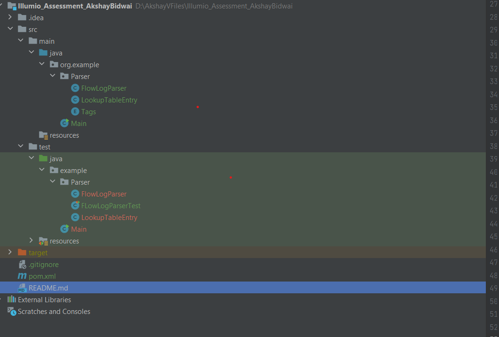
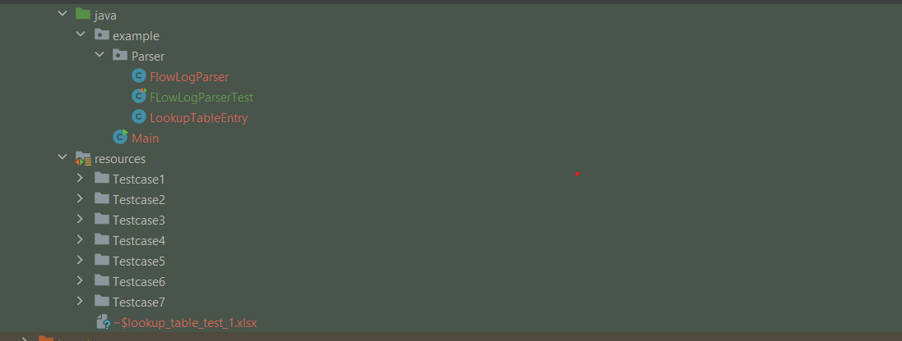

# **Flow Log Parser**

---

## **Overview**

This project is a **Flow Log Parser** that processes AWS VPC Flow Logs and maps each row to a tag based on a lookup table. The lookup table is defined as a CSV file with three columns: `dstport`, `protocol`, and `tag`. The destination port and protocol combination decide what tag is applied to each flow log entry.

The parser supports the **default flow log format** and **only supports version 2** of the flow log. Any other version will be ignored, and an appropriate error will be logged.

---

## **Assumptions**
- **Only version 2** of AWS flow logs is supported. Logs from any other versions will be skipped.
- The input flow log file must be in **ASCII format / Text File that contains entries line by line** and can be up to **10 MB** in size.
- The lookup table is provided in a CSV file with the format: `dstport, protocol, tag`. The lookup is case-insensitive.
- Destination port and protocol are used for tag matching.
- If no valid flow log entries are processed, an error message is logged and written in the report.

---

## **Features**
- Parse flow logs and tag entries based on the lookup table.
- Count occurrences of each tag and report port/protocol combination counts.
- Supports multiple test cases, each with different flow logs and lookup table combinations.
- Provides a summary report as output in **CSV format**.

---

## **Potential Error Encounter**

In reviewing the provided sample test case and its expected output over Email, I identified a few discrepancies that need to be corrected:

Tag Count Error:

The sv_P4 tag count is listed as 1, but upon evaluation, it should be 0. This is because there was no entry in the flow log with a destination port of 22 and TCP protocol combination.

Untagged Count Error:
The total number of Untagged entries is 8, but the output incorrectly states it as 9.
Missing Port/Protocol Combinations:

Several Port/Protocol combinations are missing from the provided output. After carefully reviewing the flow log entries, I corrected the output to reflect all the port/protocol combinations.

I have implemented these corrections in the first test case, as shown in the test([FLowLogParserTest.java](src%2Ftest%2Fjava%2Fexample%2FParser%2FFLowLogParserTest.java)) file.


## **Prerequisites**
- **Java 8** or higher
- **Apache Maven for JUnit**

---

## **Project Structure**
Here’s the current project structure:



## **Input Files and Output File Location**
- Files are Under Resources Folder
- to add additional testcases please create the folder in the same location and add necessary inputfiles.
- Please note that flowlog file must be .txt and lookup table must be CSV



## **How to Run the Project**

---

### **1. Jump into the Test Class:**

The test cases for the project are written in the `FLowLogParserTest.java` file located at:

```
src/test/java/example/Parser/FLowLogParserTest.java
```

You can simply click the **Run** button (the green play button) in the top right corner of your IDE to execute the test cases.

---

### **3. Run Tests via Terminal:**

Alternatively, you can run the tests using Maven from the terminal by running the following command:

```bash
mvn test
```

---

### **4. Test Results:**

After running the tests, reports will be generated and saved in the respective `outputfile_test_*.csv` files located in:

```
src/test/resources/Testcase*/outputfile_test_*.csv
```

---
### **5. Add Additional Test Cases:**

To add additional test cases, follow these steps:

1. **Navigate to the directory:**

   ```
   src/test/resources/Testcase
   ```

   2. **Add two files:**
       - A **TXT file** that contains the flow log entries.
       - A **CSV file** that contains the lookup table.

   3. **Write the test case:**
       - Open `FLowLogParserTest.java`.
       - Write a new test function that uses the new files.

   4. **Run the test:**
       - After adding the new test case, run it using your IDE or via the terminal with `mvn test`.

---